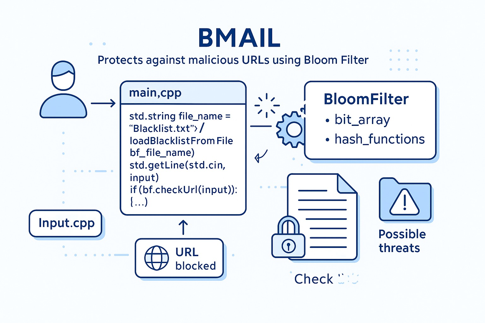
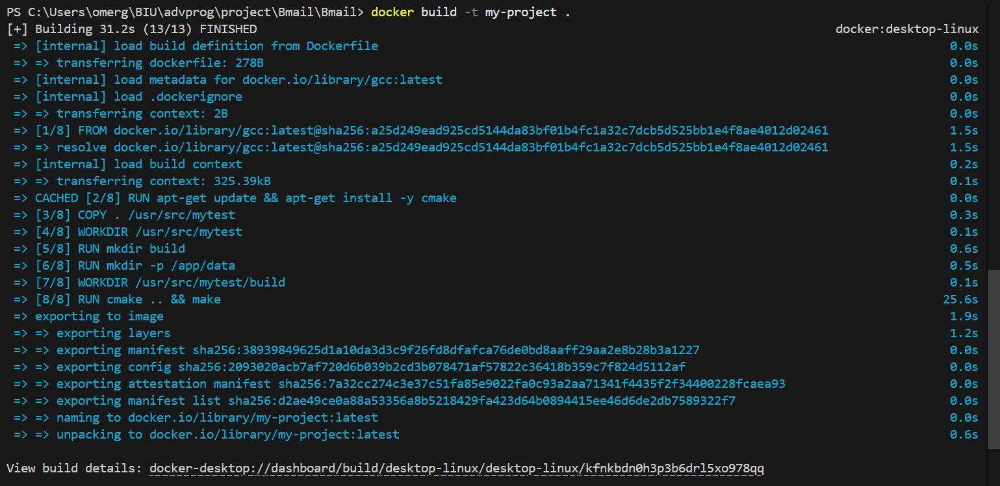
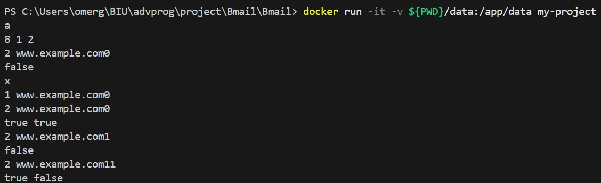
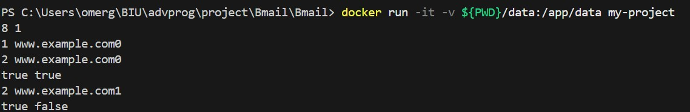
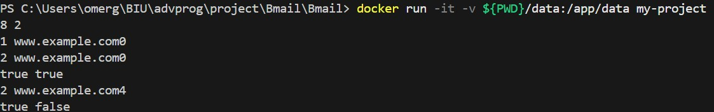
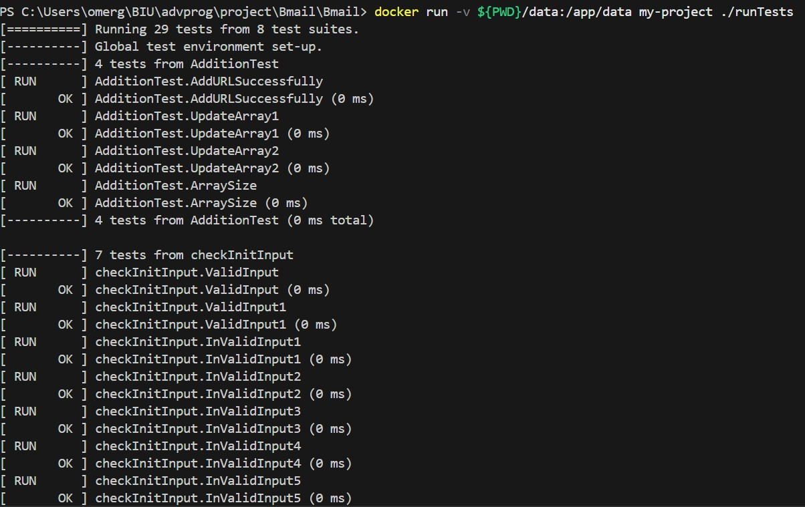
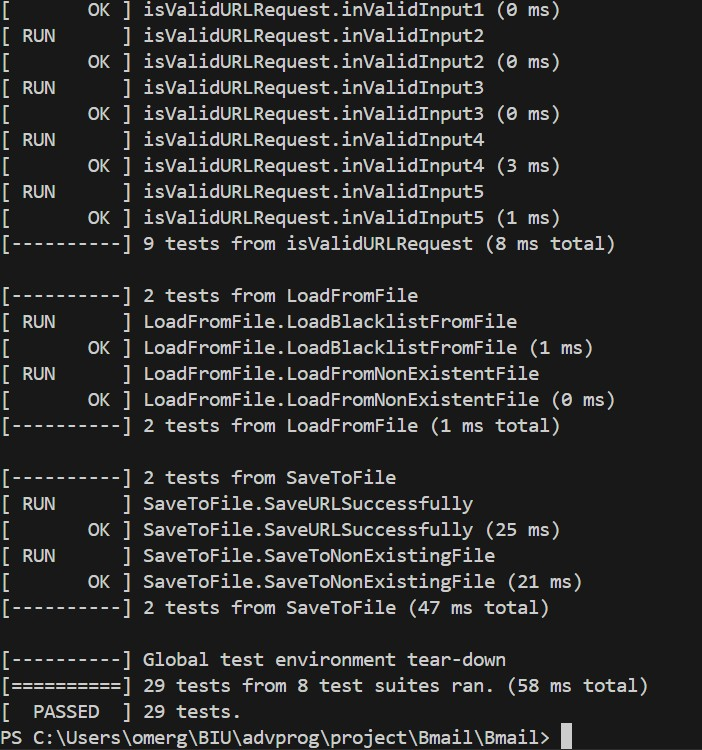

# Bmail



# Bloom Filter URL Blacklist Manager

Bmail is a C++ project that implements a **Bloom Filter system** for managing a **URL blacklist**.  
It provides functionality for:

- Adding URLs to the blacklist.
- Checking if a given URL exists in the blacklist (including double-checks for false positives).
- Saving and loading the blacklist to/from a file.
- Comprehensive unit tests for the entire functionality.

This README provides an overview of the project, installation and running instructions, and architecture details.

---

## Getting Started

The project is built in **C++**, using **CMake** for building and includes a **Dockerfile** for easy containerization.

When the program runs, it loads an existing URL blacklist from `data/Blacklist.txt` if it exists.  
You can add new URLs, validate input, and check URLs against the blacklist.  
Updates are automatically saved back to the file.

---

# Project Structure

```text
BMAIL/
|
├── README.md
├── CMakeLists.txt
├── DockerFile
|
├── src/
| ├── BloomFilter.cpp
| ├── BloomFilter.h
| ├── functions-test.cpp
| ├── Input.cpp
| ├──Input.h
| ├── main.cpp
| ├── Storage.cpp
| └── Storage.h
|
├── data/
| ├── Blacklist.txt
```

### Installation

Clone the repository:

```bash
git clone - https://github.com/itaisalman/Bmail
```

### Executing The Program

First, build the Docker image with the following command:

```bash
docker build -t my-project .
```

Then, to run the main Program run the following command:

```bash
docker run -it -v ${PWD}/data:/app/data my-project
```

But, if you would like instead, to run the tests code, run the following command:

```bash
docker run -v ${PWD}/data:/app/data my-project ./runTests
```

## Authors

[Itai Salman](https://github.com/itaisalman)  
[Omer Golan](https://github.com/Omergolan11)  
[Shachar Ganon](https://github.com/ShacharGanon)

## Screenshots Exampels

### Build:



### Runs:







### Tests:




