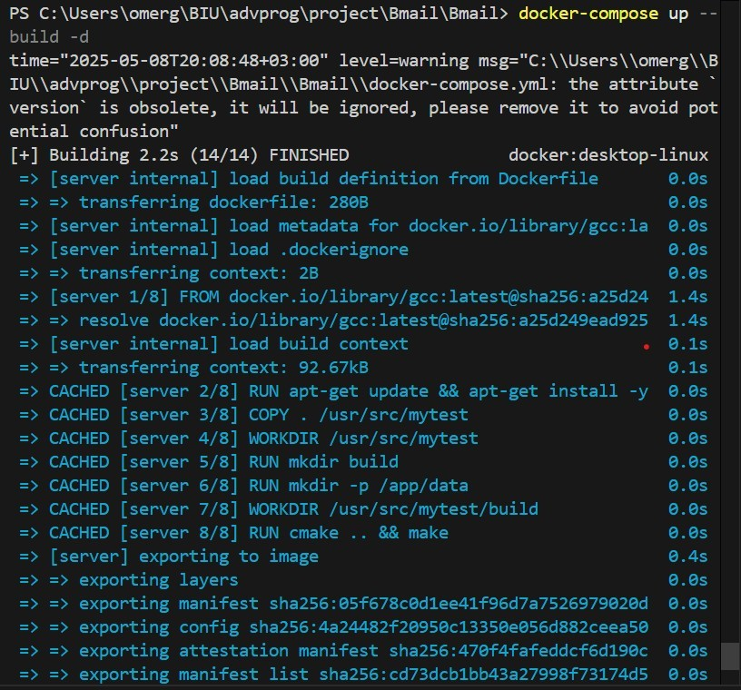
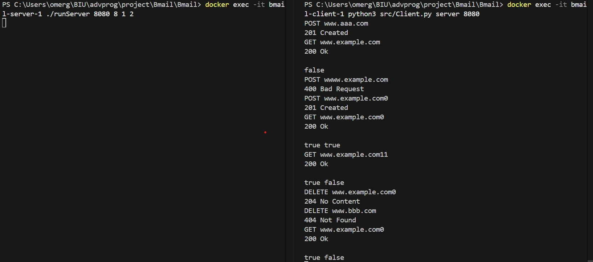
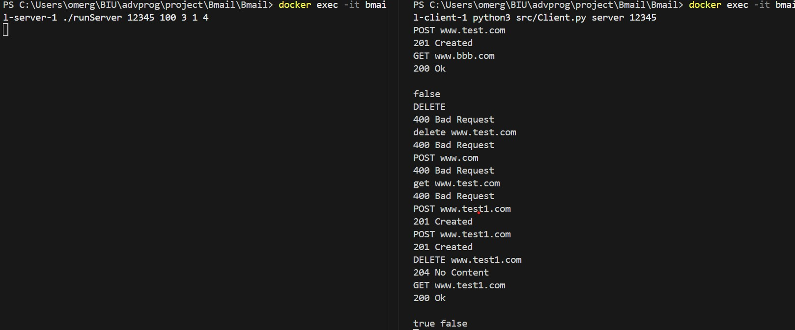
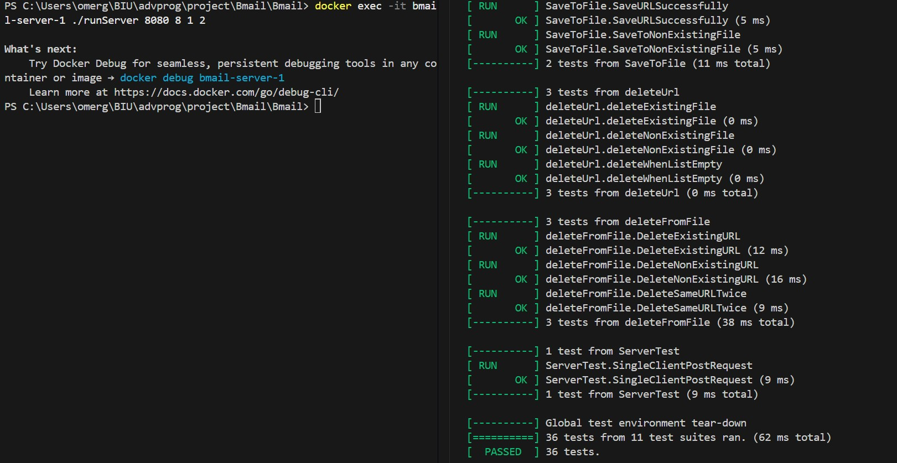

# Bmail

# Bloom Filter URL Blacklist Manager

Bmail is a C++ project that implements a **Bloom Filter system** for managing a **URL blacklist** over a **TCP client-server** architecture.  
It provides functionality for:

- Add URLs to the blacklist (POST command).
- Check if URL exists in the blacklist (GET command), including double-checks for false positives.
- Delete URLS from the blacklist file (DELETE command).
- Save, load and delete the blacklist to/from a file.
- Communicate entirely over TCP sockets, with separation between server logic and client.
- Run comprehensive unit tests to validate all functionality

This README provides an overview of the project, installation and running instructions, and architecture details.

---

## Getting Started

The project is built in **C++**, using **CMake** for building and includes a **Dockerfile** for easy containerization.

When the program runs, it loads an existing URL blacklist from `data/Blacklist.txt`.  
The client connects to the server over TCP sockets and sends commands (POST, GET, DELETE) via a persistent connection.

Each command is entered by the user in the client terminal and sent to the server over the socket. The server processes the command, responds with a corresponding status message, and the client prints it to the console.

All updates to the blacklist are automatically saved back to the file. The server handles only one client at a time throughout a session, maintaining the same socket connection for all interactions.

---

# Project Structure

```text
BMAIL/
|
├── README.md
├── CMakeLists.txt
├── DockerFile
├── docker-compose.yml
|
├── src/
| ├── Add.cpp
| ├── Add.h
| ├── BloomFilter.cpp
| ├── BloomFilter.h
| ├── Check.cpp
| ├── Check.h
| ├── Client.py
| ├── Command.h
| ├── Delete.cpp
| ├── Delete.h
| ├── functions-test.cpp
| ├── Input.cpp
| ├── Input.h
| ├── server-tests.cpp
| ├── Server.cpp
| ├── Storage.cpp
| └── Storage.h
|
├── data/
| └── Blacklist.txt
|
├── photos/
| └── *.jpg

```

### Installation

Clone the repository:

```bash
git clone - https://github.com/itaisalman/Bmail
```

### Executing The Program

Start by building and launching the containers using Docker Compose:

```bash
docker-compose up --build -d
```

**Running the Server**
To start the server, execute:

```bash
docker exec -it bmail-server-1 ./runServer <num_of_port> <array_size> <hash_functions>
```

For example,

```bash
docker exec -it bmail-server-1 ./runServer 8080 8 1 2
```

**Running the Client**
In a separate terminal, connect the client to the server using:

```bash
docker exec -it bmail-client-1 python3 src/Client.py server <num_of_port>
```

The client port must be the same as the server port.

For example,

```bash
docker exec -it bmail-client-1 python3 src/Client.py server 8080
```

**Running the Tests**
To run the unit tests, after the server container is running (the tests reset the blacklist), use:

```bash
docker exec -it bmail-server-1 ./runTests <num_of_port> <array_size> <hash_functions>
```

For example,

```bash
docker exec -it bmail-server-1 ./runTests 8080 8 1 2
```

## Authors

[Itai Salman](https://github.com/itaisalman)
[Omer Golan](https://github.com/Omergolan11)
[Shachar Ganon](https://github.com/ShacharGanon)

## Screenshots Exampels

### Build:



### Runs:





### Tests:



## Code resistance to changes according to the Open/Closed principle

1. **Command names have changed**
   No changes to the closed code are required for the changes.
   The commands are represented by classes (Add, Check, Delete) that inherit from the Command base class.
   The identification by string (such as "POST", "GET") is done in the control layer (Server.cpp) only. Changing the names of the commands does not require changes to the functional classes – only in the mapping between the command name and the corresponding class. This allows for extension without changing the logic itself
2. **New commands added**
   To add a new command, we added a new class that inherits from Command and implements the execute function.
   We didn't change the existing code in the old classes - we just added a new implementation and added selection using a more flexible Map structure.
3. **Command output has changed**
   Each command class implements the output method itself, or returns the output to the server for the client to send.
   We changed the function signatures so that the printing is in one function per class and thus the changes in the output format (e.g. adding "200 Ok\n") were made within these classes only.
4. **Input/output was passed from sockets instead of the console**
   We moved to implementing an I/O layer on the server and the client without changing the business logic or the class structure. The logic continues to be based on incoming and outgoing strings, so the change did not affect the functions that perform the operations themselves.
