# Bmail

**Bmail** is a project built with Node.js and C++ that simulates an email system with advanced functionality for managing users, emails, labels, and a blacklist of URLs. The system follows an MVC architecture, where the Node.js backend communicates with a Bloom Filter server via TCP sockets.

### **Key Features**

- **User Management** – Registration, login, and access to user details by ID.
  Adding a user via POST requires several fields: first_name, last_name, birth_date (DD/MM/YYYY), gender (Male/Female/Other), username, password, and an optional profile picture. If no picture is provided, a default image is assigned based on gender.
  Input is validated for format and uniqueness (no duplicate usernames).

- **Tokens** – Tokens are issued upon login and used to securely identify users during subsequent requests. The system verifies token validity and ensures the user exists.

- **Mail Management** – Supports send, search, delete, edit, and save as a draft. Each email includes fields: receiver_id, title, content, and draft (which is "true" or "false"). If draft is "true", the email is only saved by the sender in drafts and is not sent; if "false", the email is sent and added to the sender's sent folder and the recipient's inbox. A draft can be edited or sent later using PATCH, and deletion is done by identifier.

- **Label Management** – Support create, get, update, and delete custom labels. Each user manages their own set of labels, each label having an id and a name. When creating or updating, the name is checked for validity and non-duplicate names for that user.

- **Blacklist Link Checking** – Every URL in an email is checked against a Bloom Filter server over TCP. The Node.js client connects to the C++ multi-threads server on a dedicated port (8080) and validates each URL.

# Project Structure

```text
BMAIL/
|
├── README.md
├── CMakeLists.txt
├── DockerFile
├── docker-compose.yml
├── package.json
├── package-lock.json
|
├── src/
| ├── controllers/
|   ├── blacklist.js
|   ├── labels.js
|   ├── mails.js
|   ├── tokens.js
|   └── users.js
| ├── models/
|   ├── blacklist.js
|   ├── labels.js
|   ├── mails.js
|   ├── tokens.js
|   └── users.js
| ├── routes/
|   ├── blacklist.js
|   ├── labels.js
|   ├── mails.js
|   ├── tokens.js
|   └── users.js
| ├── Add.cpp
| ├── Add.h
| ├── app.js
| ├── BloomFilter.cpp
| ├── BloomFilter.h
| ├── Check.cpp
| ├── Check.h
| ├── Client.py
| ├── Command.h
| ├── Delete.cpp
| ├── Delete.h
| ├── functions-test.cpp
| ├── Input.cpp
| ├── Input.h
| ├── server-tests.cpp
| ├── Server.cpp
| ├── Storage.cpp
| └── Storage.h
|
├── data/
| ├──  Blacklist.txt
| └── upload/
|   ├── default_female.png
|   └── default_male.jpeg
|
├── photos/
| └── *.jpg

```

# Getting Started

The Bmail project is a Node.js-based system that allows users to send, search, and manage emails and labels. It runs alongside a C++ server that maintains a Bloom Filter for checking blacklisted URLs. Both servers run in separate Docker containers and communicate over TCP.

## Folder Overview

The src folder is structured according to the MVC architecture: routes define the API endpoints, controllers handle the business logic and response formatting, and models manage in-memory data and enforce validation rules.

# Executing The Program

To start the system, simply run:

```bash
docker compose up --build
```

This will spin up two containers:

- Node.js app (port 3000) – handles API requests for users, emails, and labels.
- C++ Bloom Filter server (port 8080) – handles TCP requests to check if URLs are blacklisted.

In another terminal we will run the rest of the commands.

# Example API Usage

Below are sample curl commands demonstrating how to interact with the Bmail system.

- _Create a New User_:

  curl -i -X POST http://localhost:3000/api/users \
  -H "Content-Type: application/json" \
  -d '{
  "first_name": "omer",
  "last_name": "golan",
  "birth_date": "20/05/2001",
  "gender": "Male",
  "username": "omergolan2001",
  "password": "Omer123!",
  "image": "www.example.com/image/1.png"
  }'

- _Get User_:

  curl -i http://localhost:3000/api/users/user_id

- _Login (Receive Token)_:

  curl -i -X POST http://localhost:3000/api/tokens \
  -H "Content-Type: application/json" \
  -d '{
  "username": "omergolan2001",
  "password": "Omer123!"
  }'

- _Send a Mail_:

  curl -i -X POST http://localhost:3000/api/mails \
  -H "Content-Type: application/json" \
  -H "user: 1" \
  -d '{
  "receiver": 2,
  "title": "Hello from user 1",
  "content": "This is a test email sent via curl.",
  "draft": "false"
  }'

- _Get The last 50 Emails_:

  curl -i -X GET http://localhost:3000/api/mails/ \
   -H "user: user_id"

  - _Get Email By ID_:

  curl -i -X GET http://localhost:3000/api/mails/mail_id \
   -H "user: user_id"

  - _Editing an Existing Email By ID_:

  curl -i -X PATCH http://localhost:3000/api/mails/2 \
  -H "Content-Type: application/json" \
  -H "user: 1" \
  -d '{
  "title": "Updated Subject",
  "content": "Updated message content.",
  "draft": "false"
  }'

- _Delete an Email By ID_:

  curl -i -X DELETE http://localhost:3000/api/mails/mail_id \
  -H "user: user_id"

- _Get All Labels_:

  curl -i -H "user: user_id" http://localhost:3000/api/labels

- _Create a Label_:

  curl -i -X POST http://localhost:3000/api/labels \
  -H "Content-Type: application/json" \
  -H "user: user_id" \
  -d '{ "name": "label_name" }'

- _Get Label By ID_:

  curl -i -H "user: user_id" http://localhost:3000/api/labels/label_id

- _Edit Label_:

  curl -i -X PATCH http://localhost:3000/api/labels/label_id \
  -H "Content-Type: application/json" \
  -H "user: user_id" \
  -d '{"name": "label_update_name"}'

- _Delete Label_:

  curl -i -H "user: user_id" -X DELETE http://localhost:3000/api/labels/label_id

- _Add a Link To The Blacklist_:

  curl -i -X POST http://localhost:3000/api/blacklist \
  -H "Content-Type: application/json" \
  -H "user: 1" \
  -d '{ "url": "www.example.com" }'

- _Deleting a Link From The Blacklist_:

  curl -i -X DELETE http://localhost:3000/api/blacklist \
  -H "Content-Type: application/json" \
  -H "user: 1" \
  -d '{ "url": "www.example.com" }'

- _Search Emails By String_:

  curl -X GET http://localhost:3000/api/mails/search/string \
   -H "user: user_id"

## Installation

Clone the repository:

```bash
git clone - https://github.com/itaisalman/Bmail
```

## Authors

[Itai Salman](https://github.com/itaisalman)
[Omer Golan](https://github.com/Omergolan11)
[Shachar Ganon](https://github.com/ShacharGanon)

## Screenshots Exampels

### Build:

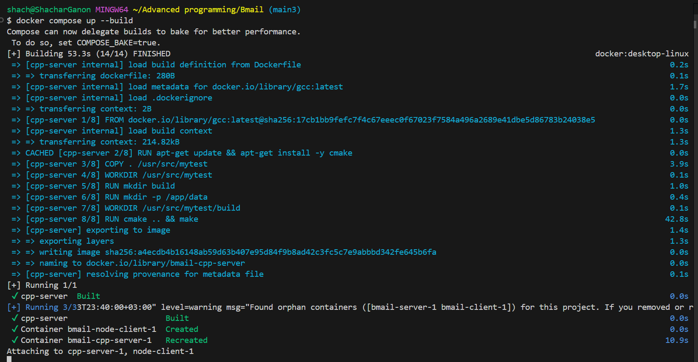

### Runs:

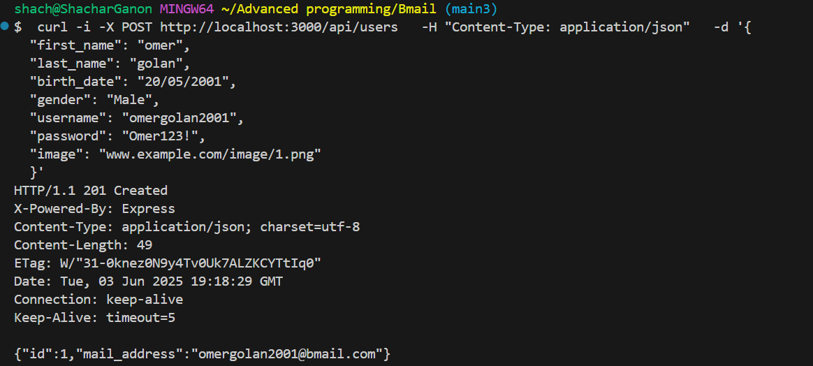

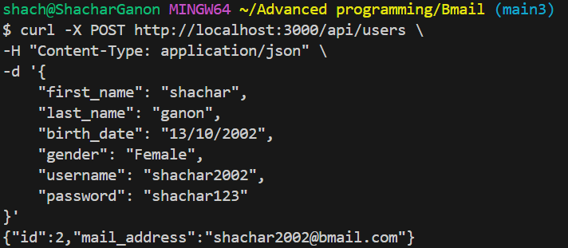

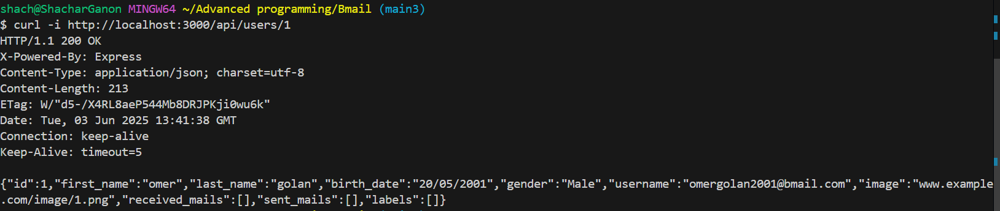

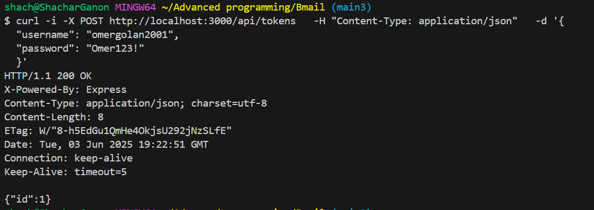

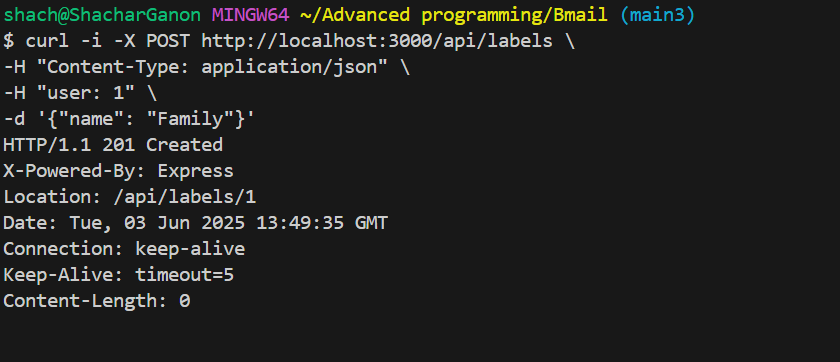

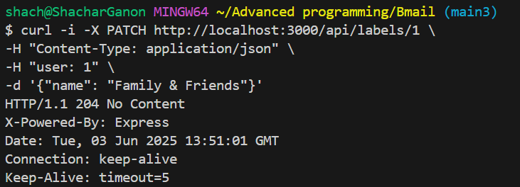

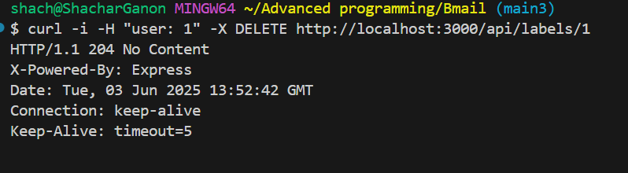

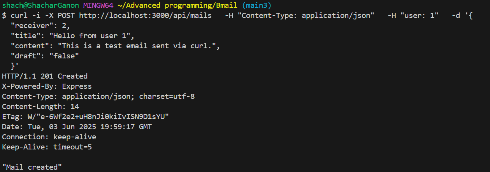

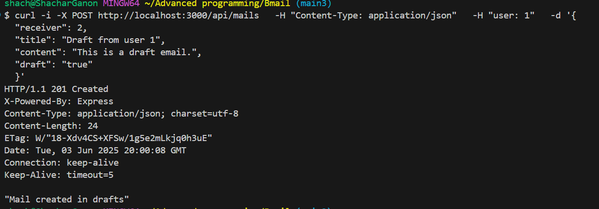

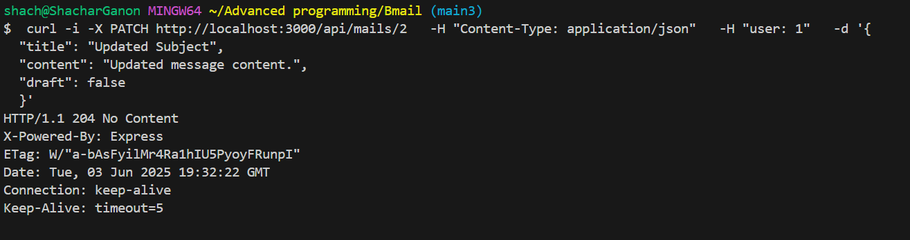

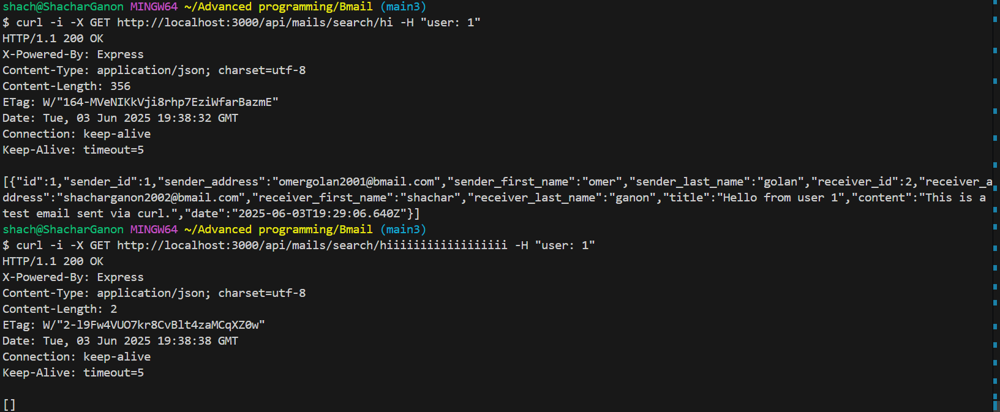

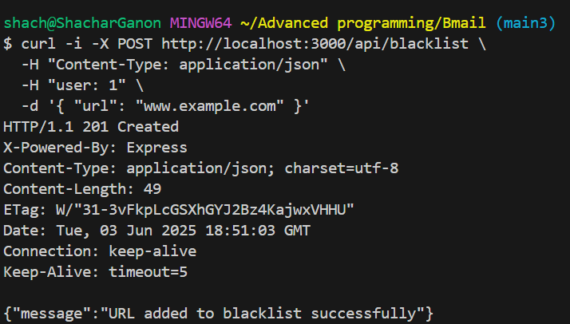
