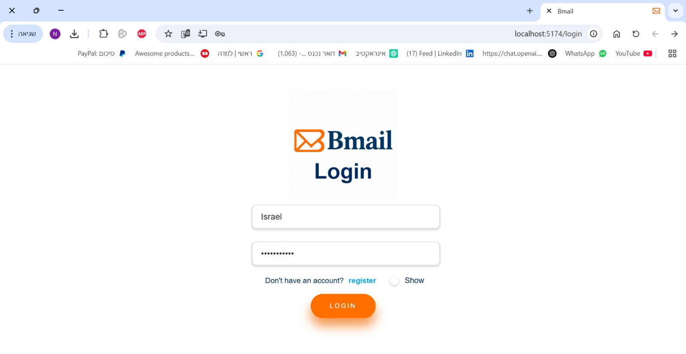
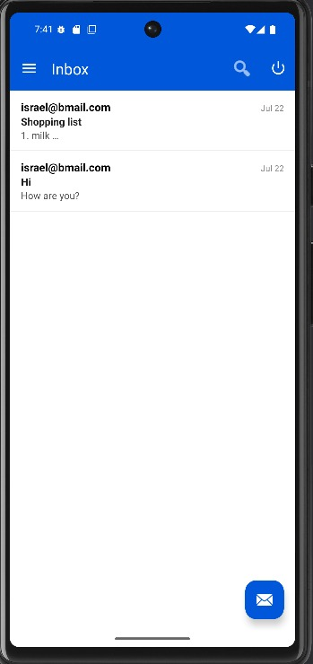
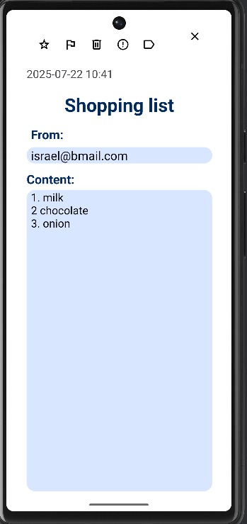

# Bmail

**Bmail** is a fullstack project that simulates an email platform with user authentication, email sending, label management, and malicious URL detection using a Bloom Filter server.

## **Key Features**

- **User Management**

Register users with name, birth date, gender, username, password, and profile picture.
Login system using JWT stored in HttpOnly cookies.
Protected routes – only authenticated users can access the app.

- **Mail Management**

Send and recieve emails with fields: receiver, title, content.
Also supports: star, mark emails as important, mark as spam and move to trash functionalities.
Save and edit drafts, and delete.
Inbox, Sent, Spam, Drafts, Trash, Labels views with filterable content.

- **Label Management**

Create, update, delete user-defined labels.
Assign labels to mails.
Labels rendered dynamically in the sidebar.

- **Blacklist Filtering**

URLs in mail content are checked via a TCP socket with a C++ Bloom Filter server.
If an email that contains a blacklisted URL is sent, it will appear in Spam section instead of in the Inbox.
Add/delete blacklist entries by adding or removing emails from Spam.
Node.js acts as a client to the C++ backend.

- **Web Client**

Gmail-inspired interface using React + React Router.
Responsive sidebar and topbar navigation.
Live search with dynamic results.
Dark/Light mode toggle using context.

- **Android Client**

The Android app mirrors the functionality of the web client.  
Built using the MVVM architecture and Room database for local offline access.  
Supports and operates all system functionality and operations.

- **MongoDB Database**

All data is stored in MongoDB, including users, emails, labels, and blacklist entries.  
The backend uses Mongoose for schema definitions and communication with the database.  
The MongoDB service runs inside Docker and is initialized automatically on first run.

## Design

### Web Client workflow

The client is built on React. It is responsible for displaying the user interface, and communicating with the server.

There is one thing to note about the client's workflow. When a user logs in, the server returns a JWT token. The client then stores this token in local storage, and uses this token to authenticate the user in every request to the server. When the user logs out, the client deletes the token from the local storage.


### Android Client workflow

Our Android client mirrors the web client's functionality, distinguished by its refined design employing the MVVM architecture. The app utilizing a local Room database. This plays a crucial role in enhancing the user experience by providing seamless access to data even in offline scenarios


## What we can do?

- First, you can create a new account using the Sign Up screen, then log in and start using Bmail.

- You can send and receive emails with full support for title, content, and receiver.

* You can edit or delete your own drafts, and remove any email from your inbox.

* You can mark emails as important or star them for quick access.

* You can create, edit, and delete labels to better organize your inbox.

* You can assign labels to emails directly from the message screen and easily navigate between inbox, drafts, spam, and trash.

* You can switch between light and dark mode by tapping the moon/sun icon at the top of the screen.

* You can edit your username and profile picture by clicking the edit icon in the top menu.

* You can log out or delete your account by clicking on your profile image in the top-right corner.

* If an email contains a blacklisted URL, it will be automatically moved to spam.

## Server API

The server is built on Node.js and Express.js. It's responsible for handling the client's requests, and communicating with the database and the TCP server.

The server exposes it's functionality through a REST API. Here's a list of the API's endpoints:

| Endpoint                 | Method | Description                             |
| ------------------------ | ------ | --------------------------------------- |
| /api/users               | POST   | Create a new user                       |
| /api/users/user_id       | GET    | Get user by ID                          |
| /api/tokens              | POST   | Log in and receive authentication token |
| /api/mails               | POST   | Send a mail                             |
| /api/mails               | GET    | Get last 50 emails                      |
| /api/mails/mail_id       | GET    | Get email by ID                         |
| /api/mails/mail_id       | PATCH  | Edit an existing email by ID            |
| /api/mails/mail_id       | DELETE | Delete an existing email by ID          |
| /api/labels              | GET    | Get all labels                          |
| /api/labels              | POST   | Create a new label                      |
| /api/labels/label_id     | GET    | Get label by ID                         |
| /api/labels/label_id     | PATCH  | Edit a label by ID                      |
| /api/labels/label_id     | DELETE | Delete a label by ID                    |
| /api/blacklist           | POST   | Add a URL to the blacklist              |
| /api/blacklist           | DELETE | Remove a URL from the blacklist         |
| /api/mails/search/string | GET    | Search emails by string                 |
| /:mail_id/assign-label   | PATCH  | Assign a mail to a label                |
| /mail/:mail_id           | DELETE | Remove a mail from its assigned label   |

Most endpoints require the user to be authenticated. The authentication is done by sending the JWT token in the request's header.


## Getting Started

### Installation

Clone the repository:

```bash
git clone - https://github.com/itaisalman/Bmail
```

### Executing The Program

To build and run the entire system:

```bash
docker compose up --build
```

Make sure Docker is installed and running on your machine.

### Accessing the Web Client

Once Docker is running, open your browser and go to:

```bash
http://localhost:5174/
```

From there, you can: Register or log in, compose and send emails, manage drafts and labels, filter by importance or starred, search and assign labels to emails and more.

### Running the Android Client

Open the Android project in Android Studio.

Run the app on an emulator or physical device.

The app connects automatically to the backend at http://10.0.2.2:3000.

## Authors

[Itai Salman](https://github.com/itaisalman)
[Omer Golan](https://github.com/Omergolan11)
[Shachar Ganon](https://github.com/ShacharGanon)

## Screenshots Exampels

#### Login




#### Registration


#### Inbox




#### Create mail


#### View mail



