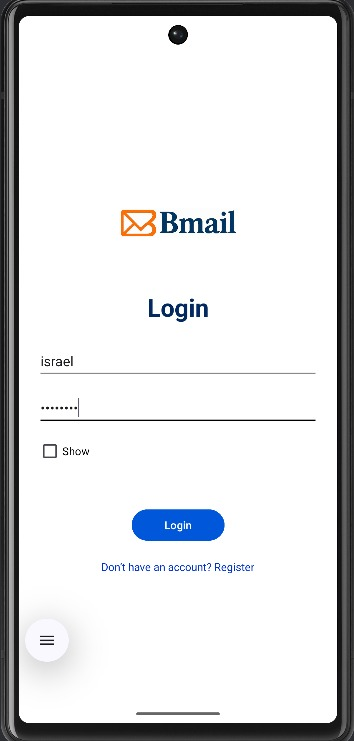

# Android Client – End-to-End Workflow

The BMAIL Android client mirrors the core functionality of the web application, designed using the **MVVM architecture** and backed by a **local Room database**.  
This local storage provides a smooth and responsive experience, even when offline.

## What Can You Do with BMAIL Android?

### Register and Log In

- To register, tap on "Sign Up", fill in all required personal details, and submit the form.
- After successful registration, you will be redirected to the login screen.
- Alternatively, you can tap "Log In" from the start if you already have an account.

### Inbox & Email Feed

- After logging in, you’ll be redirected to your inbox.
- From there, you can:
  - View received emails
  - Open specific email threads
  - Filter emails by labels

### Create, Edit, and Delete Emails

- You can create a new email by tapping the "Compose" button.
- Draft emails can be edited before being sent.
- Any email can be deleted.
- If an email contains a URL that appears in the blacklist, it will be automatically classified as spam.

### Labels

- You can add, edit and delete labels according to your preferences.
- You can assign labels to emails from the message screen.
- Labels help organize and categorize your emails.

### Light & Dark Mode

- Tap the theme icon at the top right to toggle between light and dark themes.

