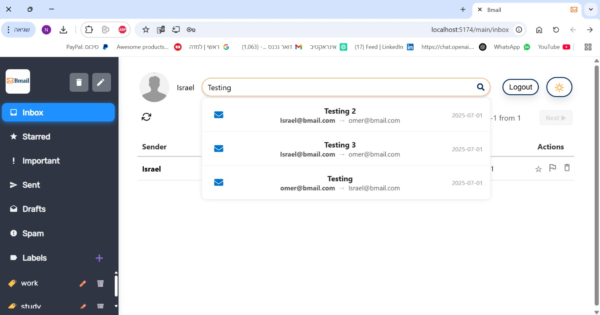
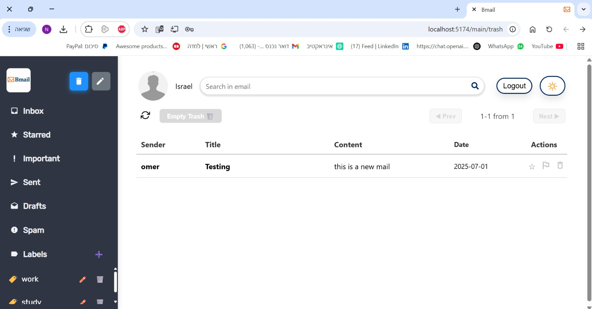

## Web Client workflow

The client is built on React. It is responsible for displaying the user interface, and communicating with the server.

There is one thing to note about the client's workflow. When a user logs in, the server returns a JWT token. The client then stores this token in local storage, and uses this token to authenticate the user in every request to the server. When the user logs out, the client deletes the token from the local storage.

## What can you do?

### Home Screen

### Sign Up Screen

### Login Screen

### Main Inbox Screen

### View Mail

### Compose New Mail

### Edit Draft

### Create New Label

### Assign Mail to Label

### Search Bar

### Trash Folder

### Dark Mode View

